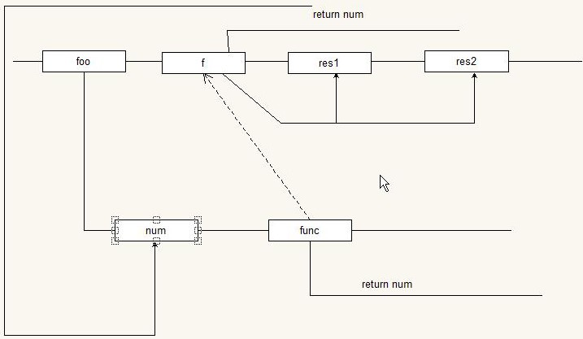

> 为了更好的理解，在阅读此文之前建议先阅读上一篇[《进击JavaScript之词法作用域与作用域链》](21.进击JavaScript之词法作用域与作用域链.md)

## 1.什么是闭包

闭包的含义就是闭合，包起来，简单的来说，就是一个具有封闭功能与包裹功能的结构。所谓的闭包就是一个具有封闭的对外不公开的，包裹结构，或空间。

在JS中函数构成闭包。一般函数是一个代码结构的封闭结构，即包裹的特性，同时根据作用域规则只允许函数访问外部的数据，外部无法访问函数内部的数据，即封闭的对外不公开的特性，因此说函数可以构成闭包。

> 概括：闭包就是一个具有封闭与包裹功能的结构。函数可以构成闭包。函数内部定义的数据函数外部无法访问，即函数具有封闭性；函数可以封装代码即具有包裹性，所以函数可以构成闭包。

## 2.闭包有什么用（解决什么问题）？

1. 闭包不允许外部访问
2. 要解决的问题就是间接访问该数据

函数就可以构成闭包，要解决的问题就是如何访问到函数内部的数据

```
function foo () {
    var num  = 123;
    return num;
}
var res = foo();
console.log( res );    // =>123
```
这里的确是访问到函数中的数据了。但是该数据不能第二次访问，因此第二次访问的时候又要调用一次foo，表示又有一个新的num = 123出来了。

在函数内的数据，不能直接在函数外部访问，那么在函数内如果定义一个函数，那么在这个函数内部中是可以直接访问的

```
function foo() {
    var num = Math.random();
    function func() {
        return mun;
    }
    return func;
}
var f = foo();
// f 可以直接访问这个 num
var res1 = f();
var res2 = f();
```

我们使用前面学习的绘制作用域链结构图的方法来绘制闭包的作用域链结构图，如下： 



## 3.闭包使用举例

### 3.1 如何获得超过一个数据

```
function foo () {
    var num1 = Math.random();
    var num2 = Math.random();
    return {
        num1: function () {
            return num1;
        },
        num2: function () {
            return num2;
        }
    }
}
```

### 3.2 如何完成读取一个数据和修改这个数据

```
function foo () {
    var num = Math.random();
    return {
        get_num : function () {
            return num;
        },
        set_num: function( value ) {
            return num = value;
        }
    }
}
```

## 4.基本的闭包结构

一般闭包的问题就是要想办法简洁的获取函数内的数据使用权，那么我们就可以总结出一个基本的使用模型。
1. 写一个函数，函数内部定义一个新函数，返回新函数，用新函数获得函数内的数据
2. 写一个函数，函数内部定义个一个对象，对象中绑定多个函数（方法），返回对象，利用对象的方法访问函数内的数据

## 5.闭包的基本用法

闭包是为了实现具有私有访问空间的函数的

**带有私有访问数据的对象**

```
function Person() {
    this.name = "张三";
    // setName( '' )
}
```

所有的私有数据，就是说只有函数内部可以访问的数据，或对象内部的方法可以访问的数据

最简单的实现：

```
function createPerson() {
    var __name__ = "";
    return {
        getName: function () {
            return __name__;
        },
        setName: function( value ) {
            // 如果不姓张就报错
            if ( value.charAt(0) === '张' ) {
                __name__ = value;
            } else {
                throw new Error( '姓氏不对，不能取名' );
            }
        }
    }
}
var p = createPerson();
p.set_Name( '张三丰' );
console.log( p.get_Name() );
p.set_Name( '张王富贵' );
console.log( p.get_Name() );
```

**带有私有数据的函数**

```
var func = function () {}
function func () {}
var foo = (function () {
    // 私有数据
    return function () {
        // 可以使用私有的数据
        ...
    };
});
```

## 6.闭包基本模型

### 6.1 对象模型

```
function foo () {
    // 私有数据
    return {
         method : function(){
             // 操作私有数据
         }
    }
}
```

### 6.2 函数模型

```
function foo(){
    // 私有数据
    return function(){
         // 可以操作私有数据
    }
}
```

## 7.沙箱模式（闭包应用的一个典范）

### 7.1 沙箱的概念

沙盘与盒子，就可以在一个笑笑的空间内模拟显示世界，特点是执行效果与现实世界一模一样，但是在沙箱中模拟与现实无关.

### 7.2 沙箱模式

沙箱模式就是一个自调用函数，代码写到函数中一样会执行，但是不会与外界有任何的影响

例如，在jQuery中

```
(function () {
   var jQuery = function () { // 所有的算法 }
   // .... // .... jQuery.each = function () {}
   window.jQuery = window.$ = jQuery;
})();
$.each( ... )
```

## 8.带有缓存功能的函数

以 Fibonacci 数列为例，改进传统计算斐波那契数列方法 
我们来回顾一下传统递归方式求斐波那契数列方法，我们定义一个count变量来查看递归了多少次：

```
var count = 0;
function fibo( n ){
    count++;
    if( n ==0 || n == 1 ) return 1;
    return fibo( n -2 ) + fibo( n -2 );
}
fib1( 20 );
console.log( count1 );
// 5: 15
// 6: 25
// ...
// 20: 21891
```

当 n = 5 式，count = 15，当时当 n = 20 的时候，count就达到惊人的21891次，性能太低了

性能低的原因是 重复计算。如果每次将计算的结果存起来

* 那么每次需要的时候先看看有没有存储过该数据，如果有，直接拿来用。
* 如果没有再递归，但是计算的结果需要再次存储起来，以便下次使用

改进版：

```
var data = [ 1, 1 ];
var count = 0;
function fibo( n ) {
    count++;
    var v = data[ n ];
    if( v === undefined ){
         v = fibo( n -1 ) + fibo( n -2 );
         data[ n ] = v;
    }
    return v;
}
fibo( 100 );
console.log( count );    // 199
```

改进之后， n = 100的时候也才199次，大大提高了性能。

## 9.闭包的性能问题

函数执行需要内存，那么函数中定义的变量，会在函数执行结束后自动回收，凡是因为闭包结构的，被引出的数据，如果还有变量引用这些数据的话，那么这些数据就不会被回收。

因此在使用闭包的时候如果不适用某学数据了，一定要赋值一个null

```
var f = (function () {
    var num = 123;
    return function () {
        return num;
    };
})();
// f 引用着函数，函数引用着变量num
// 因此在不适用该数据的时候，最好写上
f = null;
```

