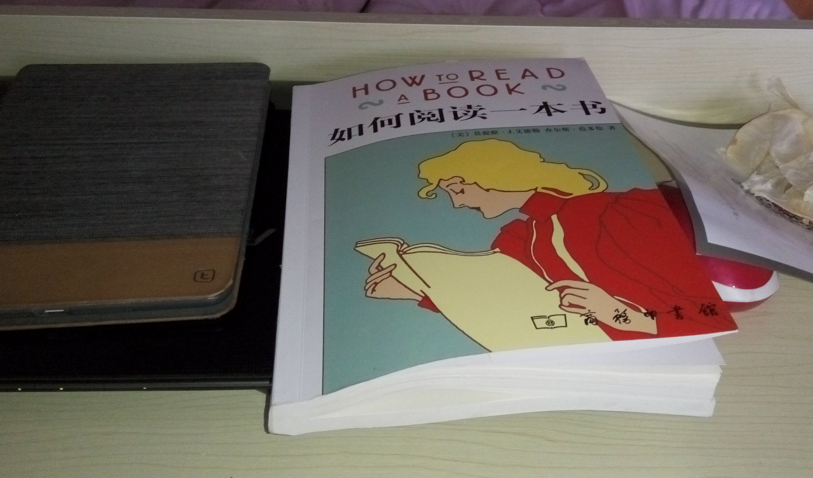

上一篇[《阅读一本书的四个层次》](http://www.jianshu.com/p/3509ba947882)已经提到，而且比较细致的说明了该如何检视阅读，这篇文章其实是第三个层次分析阅读的详细说明。

每一本书的封面之下都有一套自己的骨架。作为分析阅读的读者，你的责任就是要找出这个骨架。

当然根据书的不同，这些规则在应用时会各有不同，次序也不同。一本小说和一本政治论述的书，整体结构不同，组成的篇章不同，次序也不同。但是，任何值得阅读的一本书，都会有一个整体性与组织架构。否则这本书会显得乱七八糟根本没法读，而烂书就是如此。

#分析阅读的第一个规则是：依照书本的种类与主题作分类
这个规则虽然适合所有的书籍，却特别适合用来阅读非小说，论说性的书。

之前我们已经建议过，一开始，你要先检视这本书――用检视阅读先浏览一遍。你读书名、副标题、目录，然后最少要看看作者序言、摘要介绍及索引。如果这本书有书衣，要看看出版者的宣传文案。这些都是作者在向你传达讯号，让你知道风朝哪个方向吹。如果你不肯停、看、听，那也不是他的错。

对于实用性和理论性的作品。要让知识变成实用，就要有操作的规则。我们一定要超越“**知道这是怎么回事**”进而明白“**如果我们想做些什么，应该怎么利用它**”。概括来说，也就是知与行的区别。理论性的作品是在教你这是什么，实用性的书在教你如何去做你想要做读完事情。

#分析阅读的第二个规则是：用最简短的句子说出整本书在谈些什么
对于“整体内容”这件事，光是一个模糊的认知是不够的，你必须要确切清楚的了解才行。只有一个方法能知道你是否成功了。你必须用几句话，告诉你自己，或别人这整本书在说什么（如果你说的话太多，表示你还没有将整本书的内容看清楚，而只是看到了多样的内容）不要满足于“感觉上的整体”，自己却说不出口。如果一个阅读者说：“我知道这本书在谈什么，但是我说不出来。”应该是连自己也骗不过的。

#分析阅读的第三个规则是：按照顺序与关系列出全书的重要部分。将全书的纲要拟出来之后，再将各个部分的纲要也要一一列出
一本书就好像一栋房子，每个部分都要很有序的排列组合在一起，每个重要部分都要有一定的独立性。就像我们看到的，每个单一部分有自己的室内架构，装潢的方式也可能跟其他部分不同。但却一定要跟其他部分连接起来――这是与功能相关――否则这个部分便无法对整体的智能架构做出任何贡献了。最好的书都有最睿智的架构，虽然他们通常比一些差一点的书要复杂一些，但他们的复杂也是一种单纯，因为他们各部分都组织的更完善也更统一。这也是为什么最好的书的也是可读性最高的书的理由之一。

###驾驭复杂的内容的技巧：为一本书拟大纲
为什么要弄这么几个规则而不是一个？主要是为了方便。用两个步骤来掌握一个复杂又未划分的架构，要比一个步骤容易的多。第二个规则在指导你注意一本书的整体性，第三个规则在强调一本书的复杂度，当你掌握一本书的整体性时便会立刻抓住一些重要部分，但是这每个部分的本身通常很复杂，各有各的内在结构而需要你去透视。

根据第三个规则，可以有一套运用的公式，这个公式可以通用的。根据第二个规则，我们可以说出这本书的内容是如此这般。做完这件事后，我们可以依照第三个规则，将内容大纲排列如下：
1. 作者将全书分为五个部分，第一个部分谈什么，第二个部分谈什么，第三个部分谈的是别的事，第四部分则是另外的观点，第五部分又是另一些事。
2. 第一个主要部分又分成三个段落，第一个段落为X，第二个段落为Y，第三个段落为Z。
3. 在第一部分的第一阶段，作者有四个重点，第一个重点是A，第二个重点是B，第三个重点是C，第四个重点是D等等。

因为没有一本书是完美的，所以也不值得为任何一本书写出一个完美的刚要。你只要尽力而为就行了。毕竟，这个规则并没有要求你将作者没有放进去的东西加在里面。你的大纲是关于作品本身的纲要，而不是这本书要谈的主题的纲要，或许某个主题的纲要可以无限延伸，但那却不是你要为这本书写的纲要――你所写的纲要对这个主题多少有点规范。

一本书的重点摘要可以用一两个句子，或是几段话就说明清楚了，但是对一本又长又难读的书，要写出仔细又适当的纲要，将个各部分以及个部分中不同的段落，各段落中不同的小节，一路细分到最小的结构单位都写清楚，可是要花好几页纸才能完成的工作。理论上来说，这份大纲可以比原著还要长，中世纪有些对亚里士多德的作品的注释都比原著还长。

本文及上一篇[《阅读一本书的四个层次》](http://www.jianshu.com/p/3509ba947882)也可以算作是一份大纲，是对《如何阅读一本书》繁多内容的归纳和整理。

#分析阅读的第四个规则：找出作者要问的问题，发现作者的意图
如果你已经在运用规则二和规则三了的话，那这一个规则就不过是换一种说法而已，你可以看出这个规则是在重复一些事情，这些事情在你掌握一本书的整体精神和重要部分的时候已经做过了，但是重复说明这个规则很有帮助，你可以用另一个角度来了解全书与各个重要部分，和能让你遵守前两条规则产生前呼后应的效果。

作者可能会，也可能不会告诉你他的问题是什么或答案是什么，不论他会不会做――尤其在不会的情况下――身为读者，你都有责任尽可能的精确找出这些问题来。

--------------------------------------
――《如何阅读一本书》札记之二